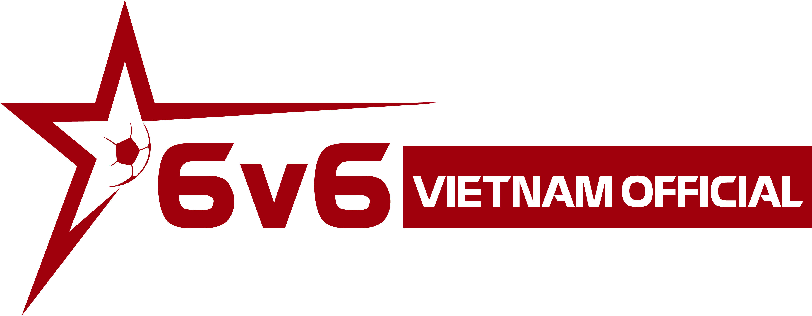

<div align="center">
  

  # 🏆 6v6 Vietnam Official - Tournament Platform

  **Nền tảng Quản lý Giải đấu Thể thao Điện tử (eSports) Chuyên nghiệp**

  
  
  
  
</div>

---

## 📖 Tổng quan Hệ thống (System Overview)

**6v6 Vietnam Official** là nền tảng website All-in-One được thiết kế riêng để tổ chức, quản lý và theo dõi các giải đấu eSports (đặc biệt chuẩn hóa cho FO4 / Efootcup). Hệ thống cung cấp trải nghiệm chuyên nghiệp cho 3 nhóm đối tượng:
- **Người xem (Public):** Trải nghiệm UX/UI cao cấp, xem lịch thi đấu, bảng xếp hạng, sơ đồ nhánh đấu và video highlights dạng Tiktok.
- **Vận động viên (Players):** Đăng ký thi đấu, tìm kiếm đồng đội, quản lý hồ sơ cá nhân và theo dõi điểm số/lịch sử thi đấu.
- **Ban tổ chức (Managers/Admins):** Quản trị vòng đời giải đấu hoàn toàn tự động từ khâu duyệt đơn, chia bảng, bốc thăm nhánh đấu cho đến cập nhật tỷ số trực tiếp.

---

## 🔥 Tính năng Cốt lõi (Core Features)

### 1. 🌐 Public Portal (Giao diện Khán giả & Tuyển thủ)
- **Hệ thống Giải đấu (Tournaments):** Trình bày chi tiết thông tin, thể lệ (rich-text), giải thưởng. Hỗ trợ đa dạng thể thức: `1v1`, `2v2`, `3v3`, `6v6`.
- **Sơ đồ nhánh đấu (Knockout Brackets):** Render sơ đồ cây thi đấu trực quan, đẹp mắt chuẩn eSports.
- **Bảng xếp hạng Vòng bảng (Standings):** Cập nhật realtime với các chỉ số chuyên sâu: Số trận, Thắng, Hòa, Thua, Thắng/Thua Penalty, Hệ số bàn thắng, và Điểm số.
- **Tiktok-style Video Highlights:** Tích hợp tab **Video** dạng vuốt dọc (snap-scrolling) cho phép khán giả xem các pha highlight/bàn thắng cực mượt trên mobile.
- **Bảng vàng (Leaderboards / BXH):** BXH tổng Hệ thống chia làm 2 nhánh: BXH Đội bóng (Teams) và BXH Tuyển thủ (Players).
- **Hồ sơ Tuyển thủ (Player Profiles):** Trang cá nhân hiển thị avatar, ID ingame, lịch sử các giải đã tham gia và thông số chi tiết.

### 2. 🛡 Manager Dashboard (Hệ thống Quản trị Giải đấu)
- **Quản lý Đăng ký (Registration System):**
  - Khung duyệt đơn thông minh.
  - Tự động cảnh báo khi trùng lặp.
  - **Auto-sync:** Khi Admin bấm "Duyệt", hệ thống tự động khởi tạo "Đội bóng" (Team) và đưa vào danh sách thi đấu chính thức.
- **Smart Roster (Quản lý Đội hình):** Hỗ trợ thêm thủ công người chơi hoặc tạo nhanh "Tài khoản Khách (Guest)" nếu người chơi chưa có tài khoản trên hệ thống.
- **Bốc thăm & Chia bảng (Draw & Groups):** Tool chia bảng đấu tự động hoặc thủ công. Thiết lập số lượng đội/bảng và số đội đi tiếp.
- **Quản lý Trận đấu (Match Center):**
  - Cập nhật tỷ số trực tiếp.
  - Hỗ trợ nhập tỷ số luân lưu (Penalty shootouts).
  - Tự động cộng/trừ điểm lên Bảng xếp hạng ngay khi trận đấu kết thúc dựa trên Scoring Logic của giải (vd: Thắng Pen +2đ, Thua Pen +1đ).
- **Video Manager:** Công cụ quản lý kho video highlights (hỗ trợ link MP4 và Embed iframe).

### 3. 🔔 Hệ thống Core (Core Systems)
- **Real-time Notifications:** Hệ thống thông báo (chuông) trong app. Thông báo tự động gửi khi đơn đăng ký được duyệt/từ chối hoặc khi có đăng ký mới.
- **Advanced Search:** Thanh tìm kiếm toàn cục (Global Search) hỗ trợ tìm Tuyển thủ, Đội bóng nhanh chóng với debouncing.
- **Custom Authentication:** Hệ thống đăng nhập/đăng ký bảo mật bằng JWT và bcrypt. Phân quyền chặt chẽ (Admin, Manager, User).
- **Rich Text Editor:** Sử dụng **Tiptap** cho phép soạn thảo Thể lệ giải đấu, mô tả cực kỳ mạnh mẽ (hỗ trợ headings, lists, links).

---

## 🏗 Kiến trúc Kỹ thuật (Technical Architecture)

- **Frontend / Backend Framework:** `Next.js 16+` (App Router) cho khả năng SSR/SSG tối ưu SEO và API Routes mạnh mẽ.
- **UI/UX & Styling:** `Tailwind CSS v4` kết hợp cùng `Framer Motion` tạo hiệu ứng mượt mà (micro-animations, trang thái hover, layout transitions).
- **Database:** `MongoDB` lưu trữ dữ liệu phi cấu trúc, tương tác qua `Mongoose` ORM.
- **Data Models:**
  - `User`: Quản lý tài khoản, role, thông tin cá nhân.
  - `Team`: Quản lý Đội hình (Đội trưởng, Thành viên, Logo).
  - `Tournament`: Lưu cấu hình giải đấu (Luật, Điểm số, Slots, Videos).
  - `Registration`: Xử lý luồng đăng ký duyệt/chờ duyệt.
  - `Match`: Quản lý từng trận đấu (Vòng bảng/Knockout, Điểm số, Penalty).

---

## 🚀 Hướng dẫn Cài đặt (Getting Started)

### Yêu cầu hệ thống (Prerequisites)
- [Node.js](https://nodejs.org/) (Phiên bản v20 trở lên)
- [MongoDB](https://www.mongodb.com/) (Local hoặc MongoDB Atlas)
- Git

### Các bước Cài đặt (Installation Steps)

**1. Clone mã nguồn**
```bash
git clone <your-repo-url>
cd 6v6-vietnam-official
```

**2. Cài đặt thư viện (Install Dependencies)**
```bash
npm install
```

**3. Cấu hình Biến môi trường (Environment Variables)**
Tạo file `.env.local` ở thư mục gốc và điền các thông tin sau:
```env
# MongoDB Connection String
MONGODB_URI=mongodb+srv://<username>:<password>@cluster.mongodb.net/6v6vietnam

# JWT Secret Key (Chuỗi bảo mật cho token)
JWT_SECRET=your_super_secret_jwt_key_here

# Domain hệ thống (Sử dụng cho các API và Links)
NEXT_PUBLIC_APP_URL=http://localhost:3000
```

**4. Chạy môi trường Development**
```bash
npm run dev
```
Truy cập hệ thống tại: [http://localhost:3000](http://localhost:3000)

---

## 📂 Cấu trúc Thư mục (Directory Structure)

```text
6v6-vietnam-official/
├── app/
│   ├── (main)/             # Tuyến đường Public (Trang chủ, Giải đấu, BXH, Profile)
│   ├── (manager)/          # Tuyến đường Protected dành cho Quản trị viên
│   └── api/                # API Endpoints (Tournaments, Matches, Auth, Users)
├── components/             # React Components dùng chung
│   ├── admin/              # UI Components của Manager Dashboard
│   ├── ui/                 # Core UI Elements (Buttons, Modals, Inputs)
│   └── layout/             # Header, Footer, Sidebar
├── lib/                    # Core Utilities (MongoDB connect, JWT auth helpers)
├── models/                 # Database Schemas (Mongoose)
├── public/                 # Assets (Images, Logos, SVGs)
└── scripts/                # Scripts dọn dẹp, giả lập dữ liệu (Seeders)
```

---

## 🤝 Hỗ trợ & Bản quyền
Được thiết kế và phát triển độc quyền cho **6v6 Vietnam Official**. Mọi quyền được bảo lưu. 
Giao diện lấy cảm hứng và kế thừa tiêu chuẩn chất lượng của nền tảng **efootcup**, mang đến trải nghiệm Thể thao điện tử chuẩn mực nhất.
